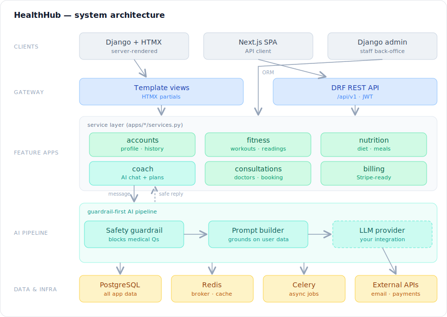
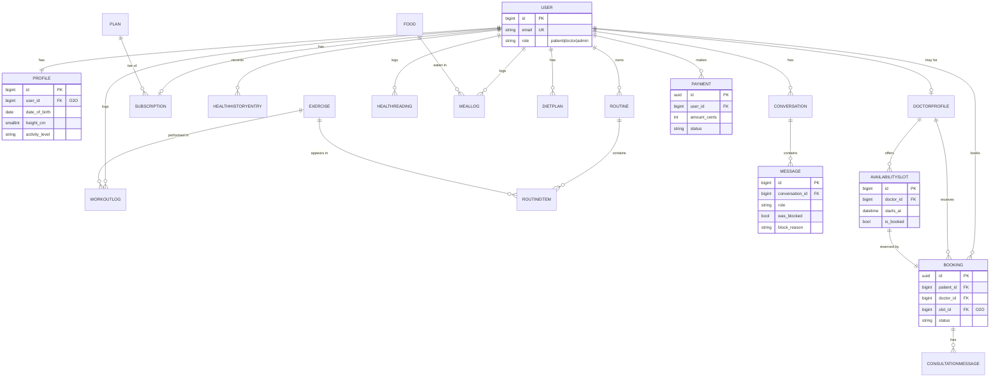

# HealthHub

> An AI fitness & wellness coach with a doctor-connection layer — built with the
> safety guardrails real health software needs.

HealthHub is a Django platform where users track their fitness, nutrition and
health readings, get **AI coaching** (with an LLM integration seam you wire up), and
**book consultations** with health professionals. The headline engineering idea
is a **guardrail-first AI pipeline**: every message is screened *before* it
reaches the model, so the coach stays in the fitness/wellness lane and refuses
to give medical advice — redirecting users to a real doctor instead.

It is built as a **hybrid backend**: a complete server-rendered Django app
**and** a versioned REST API (`/api/v1/`) over the same service layer — so a
Next.js frontend (included) consumes the exact same backend with zero logic
duplication.

---

## Table of contents

- [Why this project](#why-this-project)
- [Architecture](#architecture)
- [Database / ERD](#database--erd)
- [Tech stack](#tech-stack)
- [Project structure](#project-structure)
- [Getting started](#getting-started)
- [Running the test suite](#running-the-test-suite)
- [API documentation](#api-documentation)
- [Roadmap](#roadmap)

---

## Why this project

Most "AI health app" demos pipe user text straight into an LLM — which is
exactly the dangerous thing real health software cannot do. HealthHub is built
to show the *responsible* version:

- **Guardrail before the model.** A transparent, auditable safety classifier
  blocks medical, emergency and mental-health-crisis messages and never lets
  them reach any LLM. Every blocked turn is recorded for audit.
- **A clean integration seam.** The coach pipeline (guardrail + persistence) is
  in place, with a clearly marked spot to plug in an LLM provider. The LLM
  integration itself is intentionally left to the developer.

---

## Architecture

One backend serves two frontends. Business logic lives in a **service layer**
that both the Django template views and the DRF API call — written once, no
drift. The AI coach runs as a guardrail-first pipeline with a clear seam for
plugging in an LLM provider.



> [View the full-size architecture diagram »](docs/architecture.svg)

| Layer | Components |
|-------|-----------|
| **Clients** | Django + HTMX (server-rendered) · Next.js SPA · Django admin |
| **Gateway** | Template views · DRF REST API at `/api/v1/` (JWT + session auth) |
| **Feature apps** | `accounts` · `fitness` · `nutrition` · `coach` · `consultations` · `billing` |
| **AI pipeline** | safety guardrail → (LLM integration seam — left to the developer) |
| **Data & infra** | PostgreSQL · Redis · Celery workers · external APIs (email, Stripe) |

### Key design decisions

- **Custom user model from migration 0001.** Email is the login identifier and a
  `role` field drives the patient/doctor split. (Swapping `AUTH_USER_MODEL` later
  is painful — so it's done up front.)
- **Service layer.** `apps/<app>/services.py` holds all business logic; views
  (template *and* API) stay thin and call the same functions.
- **Guardrail as a pluggable function.** `guardrail.classify()` is a transparent
  rule set today, swappable for an ML classifier without touching callers.
- **Booking race safety.** `book_slot()` locks the slot row with
  `select_for_update()` inside a transaction so two patients can't grab one slot.
- **UUID primary keys** on `Booking` and `Payment` (they appear in URLs/APIs) to
  avoid enumeration; `BigAutoField` everywhere else.
- **Settings split** — `config/settings/{base,dev,prod,test}.py`; all secrets
  come from the environment (12-factor) via `django-environ`.

---

## Database / ERD

`User` is the hub; everything else hangs off it. Bookings and payments use UUID
PKs. (GitHub renders the Mermaid diagram below.)



Full table/column listing: see [`docs/erd.md`](docs/erd.md).

---

## Tech stack

| Area | Technology |
|------|-----------|
| Language | Python 3.12+ |
| Web framework | Django 5.2 |
| API | Django REST Framework, SimpleJWT, drf-spectacular (OpenAPI) |
| Async / tasks | Celery + Redis |
| Database | PostgreSQL (SQLite for zero-config local dev) |
| Server-rendered UI | Django templates + HTMX + Tailwind (Play CDN) |
| Frontend SPA | Next.js 14 (App Router) · TypeScript · Tailwind CSS |
| Payments | Stripe (models scaffolded; integration in a later phase) |
| Testing | pytest, pytest-django, factory-boy |
| Quality | ruff (lint + format), pre-commit |
| Tooling | Docker / docker-compose, GitHub Actions CI |

---

## Project structure

```
healthhub/
├── config/                  # settings split, root urls, api router, celery
│   └── settings/            # base · dev · prod · test
├── apps/
│   ├── common/              # shared abstract models + seed_demo command
│   ├── accounts/            # custom User, profile, health history
│   ├── fitness/             # exercises, routines, workout logs, readings
│   ├── nutrition/           # foods, meal logs, diet plans
│   ├── coach/               # AI coach: guardrail + orchestrator (LLM seam)
│   │   └── services/        # guardrail.py · coach.py
│   ├── consultations/       # doctors, availability, bookings, messaging
│   ├── billing/             # plans, subscriptions, payments (Stripe-ready)
│   └── notifications/       # async email task
├── templates/               # base layout (Tailwind + HTMX)
├── frontend/                # Next.js app consuming /api/v1
├── requirements/            # base.txt · dev.txt
├── docs/                    # architecture.svg · erd.md
├── docker-compose.yml
└── manage.py
```

Each app follows the same shape: `models.py` · `services.py` (business logic) ·
`admin.py` · `api/` (serializers, views, urls) · template `views.py`/`urls.py` ·
`tests/`.

---

## Getting started

### 1. Backend — quick start (SQLite, no external services)

```bash
git clone <your-repo-url> healthhub && cd healthhub

python -m venv .venv && source .venv/bin/activate
pip install -r requirements/dev.txt

cp .env.example .env                  # defaults work out of the box
python manage.py migrate
python manage.py seed_demo            # demo exercises, foods, a doctor + slots
python manage.py createsuperuser
python manage.py runserver
```

- App: <http://localhost:8000/>
- Admin: <http://localhost:8000/admin/>
- API docs (Swagger): <http://localhost:8000/api/docs/>

### 2. Backend — full stack (PostgreSQL + Redis + Celery)

```bash
docker compose up --build
```

This starts Postgres, Redis, the Django web server and a Celery worker. The web
container runs migrations on boot.

### 3. Frontend — Next.js (optional)

Requires Node 18.18+ (Node 20 LTS recommended). The Django API must be running.

```bash
cd frontend
cp .env.local.example .env.local      # points at http://localhost:8000/api/v1
npm install
npm run dev                           # http://localhost:3000
```

See [`frontend/README.md`](frontend/README.md) for details.

### Configuration

All configuration is environment-driven — see [`.env.example`](.env.example).
Notable settings:

| Variable | Purpose |
|----------|---------|
| `DATABASE_URL` | Unset → SQLite. Set to a `postgres://…` URL for PostgreSQL. |
| `CELERY_BROKER_URL` | Redis URL for Celery |
| `STRIPE_*` | Stripe keys (used once billing is wired up) |

### The AI coach

The coach pipeline (safety guardrail + conversation persistence) is implemented,
but **no LLM is integrated** — that's left to you. Until you wire one in, the
coach returns a placeholder reply for non-blocked messages. The integration seam
is clearly marked in [`apps/coach/services/coach.py`](apps/coach/services/coach.py).

The guardrail runs regardless — ask the coach a medical question and watch it
refuse and redirect to a consultation, before any model would ever be called.

---

## Running the test suite

```bash
pytest                    # behavioural test suite (uses in-memory SQLite)
pytest --cov              # with coverage
ruff check apps config    # lint
```

The tests verify *behaviour*, not just status codes — e.g. the guardrail blocks
medical questions before the LLM, users can't see each other's data, and double
-booking a slot is rejected.

---

## API documentation

Interactive, auto-generated from the code:

- Swagger UI — `/api/docs/`
- ReDoc — `/api/redoc/`
- OpenAPI schema — `/api/schema/`

Auth: obtain a JWT at `POST /api/v1/auth/token/` with `{ "email", "password" }`,
then send `Authorization: Bearer <access>`.

---

## Roadmap

Phase 1 (this repo) ships the full core. Planned next:

- [ ] Live Stripe payments (subscriptions + per-consultation fees)
- [ ] Real-time consultation chat (Django Channels / WebSockets)
- [ ] Video consultations
- [ ] Wearable / device sync for automatic health readings
- [ ] Full Next.js parity with the Django UI
- [ ] ML-based guardrail classifier alongside the rule set

---

## License

MIT
